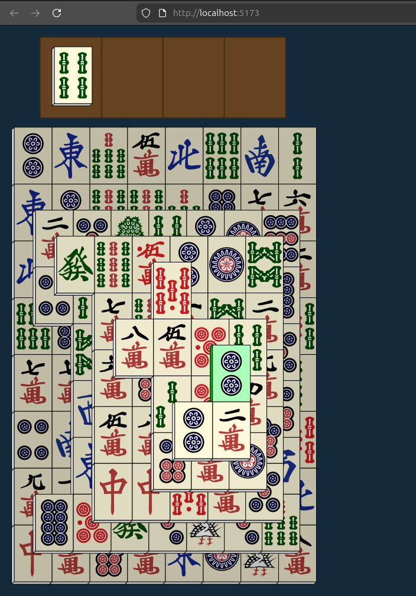

## PahJS

Implementation of [Mahjong Solitaire](https://en.wikipedia.org/wiki/Mahjong_solitaire), inspired by [Vita Mahjong](https://vitastudio.ai/). I don't know how to link to the actual app - it just came pre-installed with my Moto e15 smartphone, and the ads annoyed me so I made my own.

Unlike most Mahjong Solitaire games, this one has some kind of trough which allows you to put up to three tiles aside to later match, which leads to much more strategic play.

I made Mahjong Solitaire in the past too: [Pahjong](https://github.com/phunanon/Pahjong).



```bash
pnpm install
pnpm start #or
pnpm build
```
